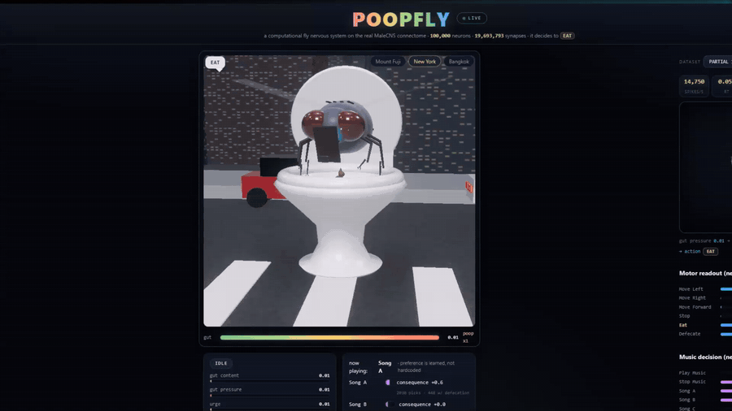

# PoopFly

**A spiking whole-MaleCNS fly brain, running in your browser.**

Not an animation. A real LIF network wired on the *Drosophila* MaleCNS connectome — it runs in a
Web Worker, spikes on the real graph, and the fly's behaviour is *read out* from its motor
populations. Nothing about the poop is scripted.

> This is the **web app**. The repo root holds the project overview, the data pipeline, and the
> science docs: [`../README.md`](../README.md) ·
> [`../docs/ASSUMPTIONS.md`](../docs/ASSUMPTIONS.md) ·
> [`../docs/ARCHITECTURE.md`](../docs/ARCHITECTURE.md).

<p>
  
  
  
  
  
</p>



---

## Why this exists

Most "brain" demos are a rule engine wearing a brain costume. This one isn't.

The fly has no `if (pressure > threshold) poopin`. Interoceptive pressure is turned into **real
spikes** injected into the connectome. Those spikes propagate through the **real measured
synapses**, and whichever motor population fires hardest *is* the decision. Ablate a region, cut
dopamine, disable plasticity — the behaviour changes because the *network* changed, not because a
branch in the code did.

> The renderer is a **view**. It never produces activity — it only shows what the kernel did.

---

## Quick start

```bash
npm install
npm run dev          # http://localhost:5173
```

```bash
npm run typecheck    # tsc --noEmit
npm test             # 25 tests (kernel, graph, closed-loop behaviour)
npm run build        # production build
```

> **Note on data size.** `public/data` holds ~1.5 GB of processed connectome binaries and is
> **served as-is, never bundled** (Vite `assetsInlineLimit: 0`). For CI or a type-check-only
> build, skip copying it:
>
> ```bash
> FLYBRAIN_SKIP_PUBLIC=1 npm run build
> ```

---

## Dataset scales

Six real subgraphs of the same connectome, switchable live from the HUD. Every number below is
**measured** by the pipeline — never a theoretical round figure.

| mode | neurons | connections | mean degree | runtime |
|---|---:|---:|---:|---:|
| `debug` | 3,000 | 340,857 | 113.6 | 7 MB |
| `partial_10000` | 10,000 | 1,741,608 | 174.2 | 35 MB |
| `partial_50000` | 50,000 | 11,103,313 | 222.1 | 224 MB |
| `partial_100000` — fast subset | 100,000 | 19,716,276 | 197.2 | 399 MB |
| **`core`** ← default — annotated neurons | **165,650** | **25,552,591** | **154.3** | **518 MB** |
| `full` — all segments, not only neurons | 1,745,204 | 32,751,675 | 18.8 | 730 MB |

`core` is the default: the complete annotated neuron connectome (165,650 neurons). `partial_100000`
is the lighter interactive subset — real hub topology at **~600 ticks/s** — where `full` sits near
0.03× real time.

### One connectome, six very different dynamical regimes

The subsets differ by **~20×** in synapses-per-neuron (mean in-degree × mean edge weight), so the
same per-synapse gain leaves the sparsest graphs silent:

| mode | synapses / neuron |
|---|---:|
| `partial_10000` | 1,504 |
| `partial_100000` | 986 |
| `core` | 749 |
| `full` | **77** |

The worker measures this at load and applies a one-time **calibration gain** so a neuron's *total*
synaptic drive is comparable across datasets. It only ever boosts, never weakens — datasets that
already run healthy are bit-identical to before.

---

## How the loop works

```
   PHYSIOLOGY                 ENCODING                CONNECTOME (Web Worker)
 ┌───────────────┐      ┌────────────────────┐      ┌──────────────────────────────┐
 │ gut content   │      │ PRESSURE           │      │  LIF spiking network         │
 │ gut pressure  │─────▶│ HUNGER             │─────▶│  on the real MaleCNS graph   │
 │ energy        │      │ MUSIC_A|B|C        │      │  typed-array kernel          │
 │ position      │      │  (Poisson drive)   │      │                              │
 └───────────────┘      └────────────────────┘      │  motor populations → rates   │
         ▲                                           └──────────────┬───────────────┘
         │                                                          │
         │                                            winner-take-all decode
         │                                                          ▼
         │        dopamine ◀── homeostatic improvement ◀── chosen action
         └──────────────────────────────────────────────────────────┘
```

1. **Drive.** Gut pressure / hunger / context are encoded as Poisson spike rates onto dedicated
   real neuron pools.
2. **Propagate.** Spikes cross the real connectome. Synaptic current is *leaky* (`tauSyn`), so
   convergent input summated across the synaptic window is what brings a neuron to threshold.
3. **Decide.** Eleven motor populations (`MOVE_*`, `STOP`, `EAT`, `DEFECATE`, `PLAY_MUSIC`, `SONG_*`)
   are read out as firing rates. The strongest one above threshold wins.
4. **Consequence.** The environment applies the action physically, then reports homeostatic
   improvement → reward → **dopamine**.
5. **Learn.** Three-factor plasticity (eligibility × dopamine) changes real synapse weights, which
   changes what the fly does next time.

Exploration (`explore`) is the one deliberately non-neural term — behavioural variability so the
fly can *discover* a rewarded action before reinforcement takes over.

---

## The brain viewer

Two point clouds, both driven only by real spikes:

- **Base cloud** — every neuron, dim, coloured by neurotransmitter or neuropil.
- **Active cloud** — neurons that just fired, drawn **in their own palette colour, deepened and
  fully saturated** rather than as white sparks. A firing GABA region goes deep blue; a firing
  cholinergic region goes deep amber. You can read *which part* is working, not just that
  *something* is.

Switch the colouring live from the control strip: **neurotransmitter** or **neuropil**.

---

## Deployment (Vercel)

The app itself is tiny — **771 KB** built. The connectome is **1.8 GB**, and that is the whole
problem: it cannot ship with the deployment.

| what | size | where it goes |
|---|---:|---|
| app (`dist/`) | 771 KB | Vercel |
| `public/data/` | 1.8 GB | object storage |

Vercel rejects a static deployment that large (and even single graph files hit 131 MB), so the data
is hosted separately and the app points at it. The repo is already wired for this:

- `.vercelignore` keeps `public/data` out of the upload
- `vercel.json` builds with `FLYBRAIN_SKIP_PUBLIC=1` so the 1.8 GB is never copied into `dist`
- `VITE_DATA_BASE` redirects every data fetch (manifests, graphs, neuron arrays, synapse details)

### 1. Put the data on object storage

Use anything that serves plain HTTP with **range/CORS support**. Cloudflare R2 is the best fit —
S3-compatible and **zero egress fees**, which matters when a single `full` session pulls ~700 MB.

```bash
# upload, preserving the data/<mode>/... layout
rclone copy public/data r2:poopfly-data/data --progress
```

Your bucket should end up as:

```
poopfly-data/
  data/
    debug/            partial_100000/    core/
    partial_10000/    partial_50000/     full/
    synapse/          build_summary.json
```

Then allow the browser to read it (R2 → bucket → Settings → CORS):

```json
[
  {
    "AllowedOrigins": ["https://your-app.vercel.app", "http://localhost:5173"],
    "AllowedMethods": ["GET", "HEAD"],
    "AllowedHeaders": ["*"],
    "MaxAgeSeconds": 3600
  }
]
```

> Get this wrong and every fetch fails as an opaque network error — CORS is the first thing to
> check if the loading screen never finishes.

### 2. Point the app at it and deploy

```bash
vercel env add VITE_DATA_BASE production
#   -> https://data.example.com      (your bucket origin, no trailing slash)

vercel --prod
```

Or via the dashboard: **Project → Settings → Environment Variables →
`VITE_DATA_BASE` = `https://data.example.com`**, then deploy. Vercel auto-detects Vite; the
`vercel.json` build command and output directory are already set.

> `VITE_DATA_BASE` is baked in at **build** time (it is a Vite env var, not runtime) — changing it
> requires a redeploy.

### Alternative: ship a small subset

You don't have to host all six modes. The app **probes which manifests exist** at startup and only
offers those in the dataset picker, so hosting any subset works with no code changes.

Keeping just `partial_100000` is **399 MB** — a much smaller upload than the full 1.8 GB, while
still carrying real hub topology:

```bash
rclone copy public/data/partial_100000 r2:poopfly-data/data/partial_100000 --progress
```

Or ship everything inside the deployment (no object storage at all) with the small modes —
`debug` + `partial_10000` is only **41 MB**. Put those two back under version control by changing
the root `.gitignore` to ignore `data/` **contents** rather than the directory itself, so the
negations take effect:

```gitignore
/webapp/public/data/*
!/webapp/public/data/debug
!/webapp/public/data/partial_10000
```

Then drop `FLYBRAIN_SKIP_PUBLIC=1` from `vercel.json` so `public/data` is copied into `dist`.
This path keeps everything on Vercel, but the repo grows by 41 MB and the browser still
downloads the binaries on first load.

---

## Project layout

```
src/
  sim/                    the brain (no DOM, no rendering)
    kernel.ts             LIF spiking kernel over typed arrays — spikes, delays, plasticity
    worker.ts             Web Worker host: loads binaries, runs the loop, posts compact frames
    agent.ts              the closed control loop (encode → decide → act → learn)
    env.ts                physiology, the 1-D loop arena, homeostasis → reward/dopamine
    populations.ts        deterministic selection of drive / motor pools from real neurons
    protocol.ts           shared types + every model parameter (DEFAULT_CONFIG)
  three/
    BrainView.ts          the live spike cloud
    ToiletScene.ts        procedural toilet, fly, poop and three switchable locations
  components/             React panels (vitals, behaviour, music, debugger, benchmark…)
  hooks/useSimulator.ts   React ⇄ worker plumbing
tests/                    kernel + graph + closed-loop behaviour
public/data/              processed connectome binaries (served as-is, not bundled)
```

### Model assumptions

MaleCNS gives **anatomy and connectivity** — not kinetics, not behaviour. Everything else is an
explicit, configurable assumption. The full write-up lives in
[`docs/ASSUMPTIONS.md`](../docs/ASSUMPTIONS.md); in code:

| assumption | where |
|---|---|
| LIF parameters (`tauM`, `tauSyn`, `vThresh`, `weightScale`, delays) | `protocol.ts → LifConfig` |
| Synaptic sign per neurotransmitter (GABA/HA inhibitory, DA/5HT/OA modulatory) | `protocol.ts → ntEffect` |
| Which real neurons act as drive / motor pools (deterministic, degree-ranked) | `populations.ts` |
| Physiology rates, arena layout, music valence | `protocol.ts → PhysioConfig`, `MusicConfig` |
| Per-dataset excitability calibration | `worker.ts → calibrationGain` |

Every parameter is live-editable from the UI — change the membrane time constant and the fly's
behaviour changes because the *simulation* changed.

---

## Data integrity

The provided `.feather` files are the **official Janelia/GCS MaleCNS v1.0 release** — the
`connectome-weights` MD5 matches the published object exactly. That official file is the **full
segment graph** ("all segments in the dataset"), so it contains far more than the 166,700 annotated
neurons; measured:

- **151.9 M** raw edges over **1.83 M** T-bar segments; **32.75 M** edges have both endpoints in
  the T-bar segment set (the graph this pipeline exports)
- **166,700** official neurons come from `body-annotations` (`superclass` present); the `core`
  graph is those neurons (165,650 with ≥1 validated edge)
- Neuron and connection counts shown in the UI are **measured**, never published round figures

The **Integrity** tab reports this per dataset rather than hiding it. If the browser can't run a
mode in real time, that's shown too — the graph is never silently reduced.

---

## Tests

```bash
npm test
```

```
✓ tests/kernel.test.ts     (7)   LIF dynamics, delays, plasticity, ablation, lazy reverse graph
✓ tests/graph.test.ts     (10)   CSR/CSC integrity, reversed-graph mapping
✓ tests/poopfly.test.ts    (9)   closed loop: neural decisions, reward, determinism
```

The behavioural tests assert the *causal chain*, not just outcomes — e.g. forcing a motor
population is what produces the action, and high gut pressure alone never hardcodes `DEFECATE`.

---

## Scripts

| command | what it does |
|---|---|
| `npm run dev` | Vite dev server, streams the real binaries |
| `npm run build` | `tsc --noEmit` + production build |
| `npm run preview` | preview the built output |
| `npm run typecheck` | types only |
| `npm test` | run the suite once |
| `npm run test:watch` | watch mode |

---

<p align="center"><sub>Built on the MaleCNS connectome · counts measured, never assumed · the fly makes its own decisions</sub></p>
